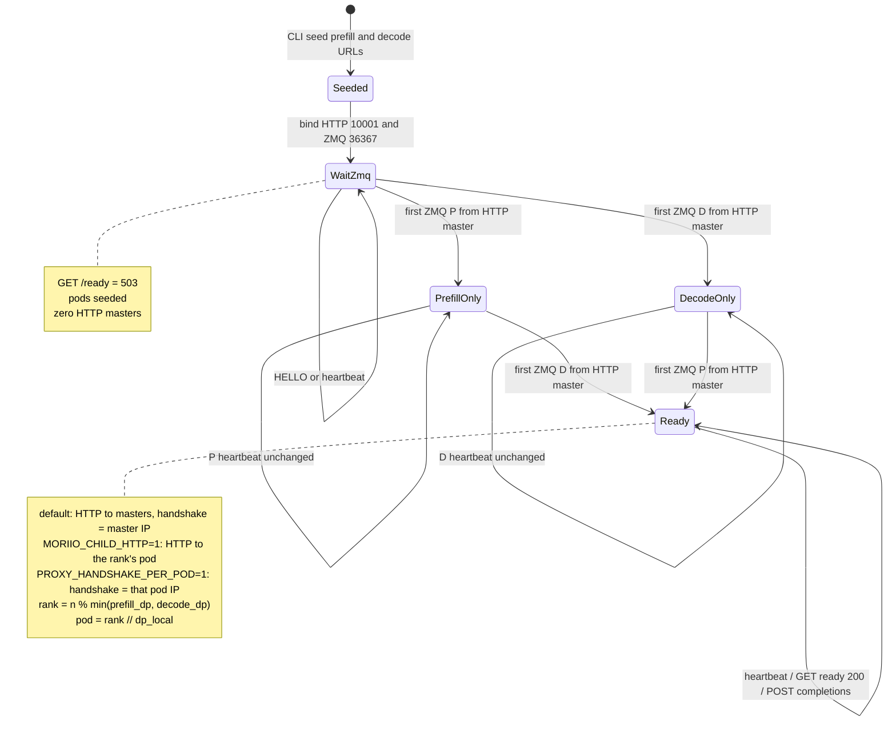
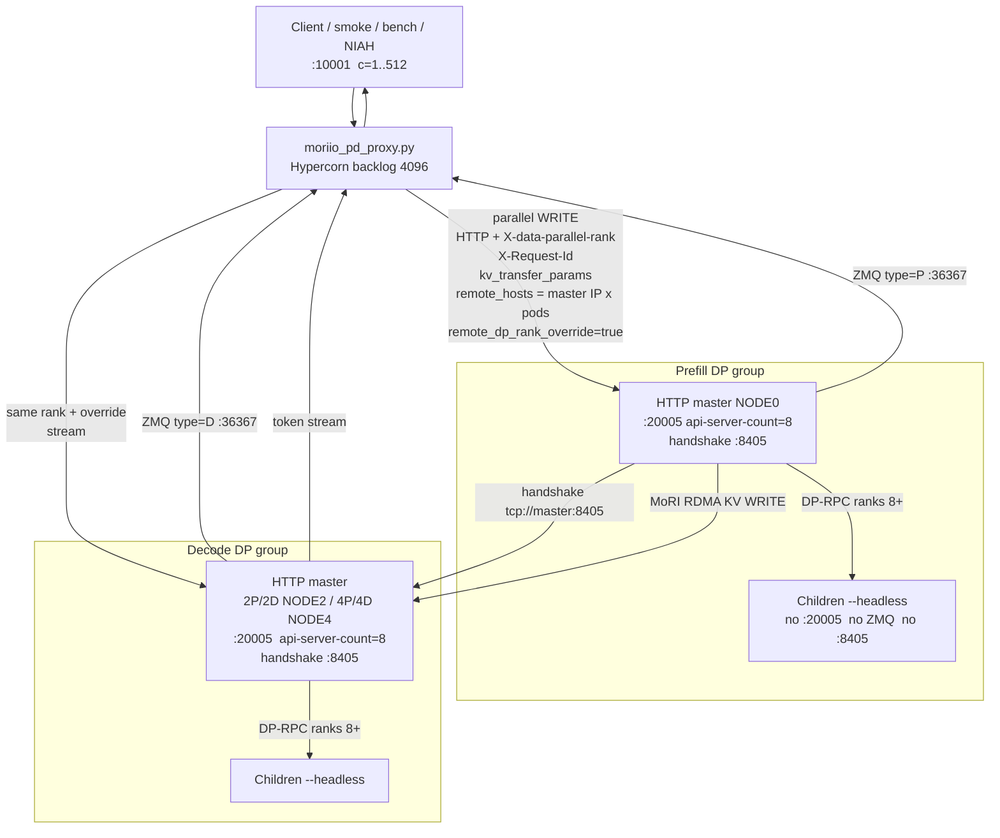
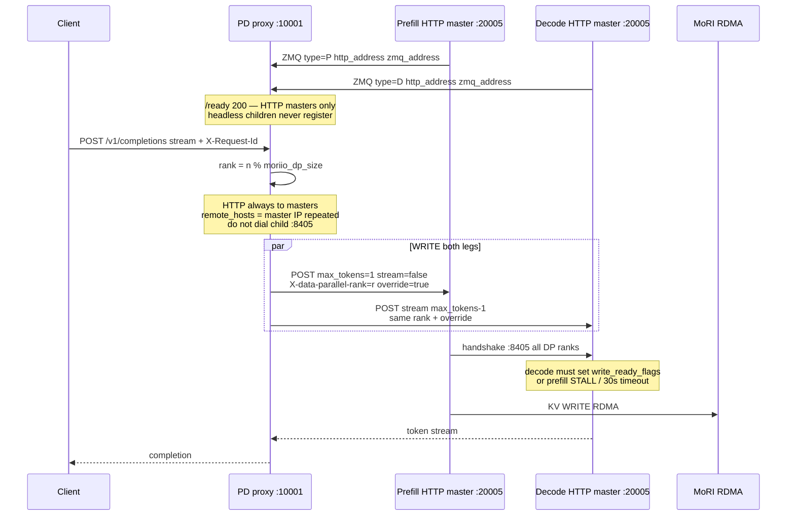

# MAD Python PD proxy (Ravi semantics)

Behavior spec is Ravi MAD #176 (`raviguptaamd/router @ ravgupta/discovery-dp-rank-roundrobin`).
Do **not** bake that Rust binary on this track. GLM 4P/4D **213116** was a **vLLM fork**,
not Rust.

`connectors/moriio.sh` prefers `proxy/moriio_pd_proxy.py` when `PROXY_TYPE` is
`moriio_toy` or `moriio_pd`. Fallback is the in-image `moriio_toy_proxy_server.py`
(missing `remote_dp_rank_override` — do not use for WideEP).

Install only if running outside the recent-source image:

```bash
pip install -r scripts/vllm_dissag/proxy/requirements.txt
```

Quart, Hypercorn, aiohttp, pyzmq, msgpack. The image already has them.
`check_deps()` fails fast with that pip line if anything is missing.

Launch (from `connector_start_proxy`): `--moriio-dp-size` = **prefill** DP
(`xP×8`: 16 / 32), `--decode-dp-size` = **decode** DP (`yD×8`). Round-robin
world is `min(P, D)` — 4P/2D pins ranks **0–15** only. Passing prefill `32`
with 2 decode pods was jobs **216534** / **216576** (18 `PARSE_ERROR` on
decode ranks 16–31). 4P/4D stays 32. `--dp-size-local` = 8,
`--expect-prefill ${xP}` `--expect-decode ${yD}`, `--prefill/--decode` once
per **pod** (CLI order = pod index). HTTP `:10001`, ZMQ discovery `:36367`
(`--use-discovery`, always on). Rank pin stays `PROXY_ROUTE_DP`. This is **not**
Ravi `concurrent prefill`. `PYTHONUNBUFFERED=1` (headless `tee` otherwise looks frozen for 10+ min).
`PYTHONPATH` includes this directory so `--middleware moriio_http_debug.log_http`
imports.

## Topology the proxy actually sees

WideEP children are `--headless`. They never bind `:20005` and never ZMQ-register.
One HTTP frontend per DP group (prefill master, decode master). Handshake `:8405`
and notify stay on that master. Child CLI IPs are topology only.

`remote_hosts` **repeats the HTTP-master IP** once per pod slot so
`rank // dp_local` still indexes the list, but WRITE never dials a headless
`:8405` (job **216121** hung on a child). Rank 8+ is `X-data-parallel-rank` on
the master API; the engine DP-RPCs to the child.

`/ready` is 200 when **each HTTP master** has ZMQ'd and CLI pod URLs are seeded.
It does **not** wait for child ZMQ (job **216057** blocked forever on P=2 D=2).
Engine-ready (weight load + graph capture) is a **separate** gate in
`connector_wait_workers_ready` — not MoRI listen on children.

HTTP `:10001`, ZMQ discovery `:36367`. Rank pin stays `PROXY_ROUTE_DP` (default
8 while children are `--headless`). **`--max-concurrency` / `PROXY_MAX_CONCURRENCY`
defaults to 512** — extra POSTs wait on the listen backlog, they are not RST'd.
WRITE already overlaps prefill+decode per request; Quart/Hypercorn overlaps
requests. This is the 512-connection requirement.

**Unpin rank 8+ without `kv=null`:** do **not** put `--kv-transfer-config` on
`--headless` children (job **216973** bound `:8405` and died in `_dummy_run`).
Set `MORIIO_CHILD_HTTP=1` (child is a real HTTP+MoRIIO server, not headless) and
`PROXY_ROUTE_DP=0`. The proxy then POSTs ranks 8+ to that pod (`http_backend`)
and `PROXY_HANDSHAKE_PER_POD=1` lists each pod IP in `remote_hosts`. Probe with
`DSV4_DP_PROBE=1`. Keep `PROXY_ROUTE_DP=8` for NIAH until that cell is green.

NIAH / long requests must use **`/v1/completions` + `stream=True` + `X-Request-Id`**.
Raw `/v1/chat/completions` without those fields `KeyError('remote_host')` on decode.

## State machine

Child URLs are present from CLI seed onward. They never change the ready bit.
Only the first ZMQ `P` and first ZMQ `D` (HTTP masters) move the machine.
Later identical payloads are `unchanged` (heartbeats). There is no separate
“Serving” state in code — POSTs run while Ready.



| State | `/ready` | What is true |
|---|---|---|
| Seeded / WaitZmq | 503 | CLI `remote_hosts` rows exist; no ZMQ yet |
| PrefillOnly / DecodeOnly | 503 | one HTTP master registered |
| Ready | 200 | both HTTP masters have `zmq_address`; POSTs allowed. With `MORIIO_CHILD_HTTP=1`, every seeded pod must ZMQ (rank 8+ handshake is otherwise a hang). |

Old (wrong) machine: Ready required ZMQ on **every** seeded URL, then HTTP to
`instances[rank // 8]` (a headless child for ranks 8+).

## Functional diagram

HTTP and ZMQ only touch **masters**. Proxy never moves KV bytes (MoRI RDMA does).
WRITE fires **prefill + decode POSTs in parallel**. Prefill `max_tokens=1`
`stream=false`; decode streams the rest (`max_tokens - 1`).



## Sequence — registration then one WRITE



Rank pin + `remote_dp_rank_override=true` is required (job **216026** in-image
toy omitted it). It is **not sufficient**: job **216066** routed rank 0 with
override, prefill **handshook** decode `:8405`, then `write_ready_flags` timed
out because decode never logged the HTTP POST.

## Contract

| Behavior | 2P/2D | 4P/2D | 4P/4D |
|---|---|---|---|
| `--moriio-dp-size` (prefill DP) | 16 | 32 | 32 |
| `--decode-dp-size` (decode DP) | 16 | 16 | 32 |
| Round-robin `min(P, D)` | 16 | **16** (not 32) | 32 |
| Prefill `remote_dp_size` | 16 | 16 (decode) | 32 |
| Decode `remote_dp_size` | 16 | 32 (prefill) | 32 |
| HTTP POST target | P master + D master | same | same |
| `X-data-parallel-rank` + `remote_dp_rank_override` | yes | yes | yes |
| ZMQ discovery | 1P + 1D HTTP masters | same | same |
| `remote_hosts` (master IP × pod slots) | 2 + 2 | 4 + 2 | 4 + 4 |
| Prefill CLI URLs / decode CLI URLs | 2 / 2 | 4 / 2 | 4 / 4 |
| Concurrency | 1–512 (queue, do not RST) | same | same |

### 2P/2D rank map (EP=16, local=8)

| Global rank | Prefill HTTP | Decode HTTP | `remote_hosts` slot (host) |
|---|---|---|---|
| 0–7 | NODE0 master | NODE2 master | 0 (prefill/decode **master** IP) |
| 8–15 | NODE0 master (`X-data-parallel-rank`) | NODE2 master | 1 (**same** master IP, not child) |

### 4P/4D rank map (EP=32, local=8)

| Global rank | Prefill HTTP | Decode HTTP | `remote_hosts` slot (host) |
|---|---|---|---|
| 0–7 | NODE0 master | NODE4 master | 0 (master IP) |
| 8–15 | NODE0 | NODE4 | 1 (same master IP) |
| 16–23 | NODE0 | NODE4 | 2 (same master IP) |
| 24–31 | NODE0 | NODE4 | 3 (same master IP) |

### 4P/2D rank map (P32 / D16) — do not pin 16–31

Decode has two pods (ranks 0–15). Curl does not send `X-data-parallel-rank`;
the proxy round-robins. `glm_ep16_curl_test.sh` is 36 POSTs, so `dp_world=32`
hits ranks 16–31 (and a few 0–3 on wrap). Decode returns non-JSON → scorer
`PARSE_ERROR`. Ignore those for quality; Lisa Su / Paris on rank 0 is the
signal. 2P/4D already routed 0–15 because the launcher used prefill DP.

| Global rank | Prefill | Decode |
|---|---|---|
| 0–15 | exists (4 pods) | exists (2 pods) |
| 16–31 | exists | **missing** — do not pin |

Smoke request 1 uses rank 0. Both HTTP legs go to the masters. Decode must
still **run** that request and raise `write_ready_flags`, or prefill hangs.

## Fixes (job-backed)

| Job / symptom | Cause | What the proxy does now |
|---|---|---|
| **216057** `/ready` never 200 | Waited for ZMQ on every seeded URL (children never register) | Ready = first ZMQ P **and** first ZMQ D |
| **216026** WRITE incomplete | In-image toy omitted `remote_dp_rank_override` | Always `true` on both legs |
| **216121** handshake hang | `remote_hosts` listed child IPs; connector dialed `:8405` on headless | Repeat HTTP-master IP per pod slot |
| **216066** silent decode POST | `PROXY_LOG_LEVEL` not in `docker -e`; no stall line | Slurm forwards the env; `STALL … after Ns` every 10s |
| **216106** drowned `proxy_NODE0.log` | 8×1.5s P/D heartbeats at DEBUG | Unchanged heartbeats summarized once / 60s (`PROXY_ZMQ_HEARTBEAT_LOG=all` to dump) |
| EngineCore “frozen” 10+ min | Headless `vllm serve \| tee` with buffered stdio | `PYTHONUNBUFFERED=1` |
| c=512 RST ~16% | Quart `app.debug=True` / toy `app.run()` | `app.debug=False`; Hypercorn backlog **4096** |
| Chat NIAH `KeyError('remote_host')` | `/v1/chat/completions` without stream / request id | Completions + `stream=True` + `X-Request-Id` |
| **216534** / **216576** 18 `PARSE_ERROR` on 4P/2D curl | Round-robin used prefill DP=32; decode only has ranks 0–15 | `route_dp=min(P,D)`; `--decode-dp-size`; per-leg `remote_dp_size` |

`run_xPyD_models.slurm` passes `-e PROXY_LOG_LEVEL` into Docker (missing on
216066/216073 — those jobs logged `level=INFO` despite submit-time DEBUG).

## Logging

Code default is **DEBUG**. WRITE itself is resolved for DSV3/Hy3 and GLM 2P/2D
short prompts; a 4P/4D sweep still grows `proxy_NODE0.log` to tens of MB — use
`PROXY_LOG_LEVEL=INFO` for ITL. Quart `app.debug` stays **False**.

| Line | Meaning |
|---|---|
| `logging configured level=` | Docker `-e PROXY_LOG_LEVEL` actually applied |
| `registered Prefill/Decode` | first ZMQ for that HTTP master |
| `registration snapshot ready=` | `/ready` would flip |
| `route api=… rank=… httpP=… httpD=…` | pin + master URLs |
| `WRITE=True firing prefill=… decode=…` | both legs about to POST |
| `decode POST START` | about to `await session.post(decode)` |
| `STALL decode POST … after Ns` | decode never returned headers |
| `decode POST HEADERS status=` | decode accepted the POST |
| `STALL decode STREAM …` | headers back, body hung (KV / generate / JIT) |
| `decode STREAM first_chunk=` | tokens started |
| `prefill POST START/HEADERS/BODY` | same for the prefill leg |

`STALL` warns every 10s (`PROXY_STALL_INTERVAL_S`). First-WRITE JIT of 10–15 min
is expected on a cold AITER cache — that is not a hang by itself.

| How | Reaches container | Where to read |
|---|---|---|
| default DEBUG | yes | `proxy_NODE0.log` |
| `PROXY_LOG_LEVEL=INFO` | yes | same file, quieter |
| `PROXY_DEBUG=1` | yes | same file |
| `--debug` / `--log-level DEBUG` | launcher argv | stdout / same file |

```bash
PROXY_TYPE=moriio_toy PYTHONUNBUFFERED=1 MODELS="DeepSeek-V3" ./run_recent_source_smoke.sh
# quiet: PROXY_LOG_LEVEL=INFO PROXY_TYPE=moriio_toy ...
```

## Decode-side debug (vLLM, default on)

`VLLM_PD_DEBUG=1` (default) adds connector INFO + `--enable-log-requests` +
`--middleware moriio_http_debug.log_http` on **masters** only.

| Where | Line | Meaning |
|---|---|---|
| `decode_NODE*.log` | `moriio_http_debug HTTP IN POST /v1/completions` | TCP reached decode `:20005` |
| same | `[pd-debug] decode update_state_after_alloc` | request entered the scheduler |
| same | `[pd-debug] decode notify should=True/False` | WRITE blocks-ready notify |
| `prefill_NODE0.log` | `[pd-debug] handshake dial tcp://IP:port` | one line per remote DP rank (16 / 32) |
| same | `[pd-debug] handshake ALL-DP done … write_ready=True` | all-to-all finished |
| same | `[pd-debug] save_kv_layer waiting write_ready_flags` | entered the wait that times out |

Silence on `HTTP IN` = proxy never landed on that API process. Handshake dials
to a **child** IP:8405 = old host-swap bug (should be master IP only).
`VLLM_PD_DEBUG=0` to disable.
